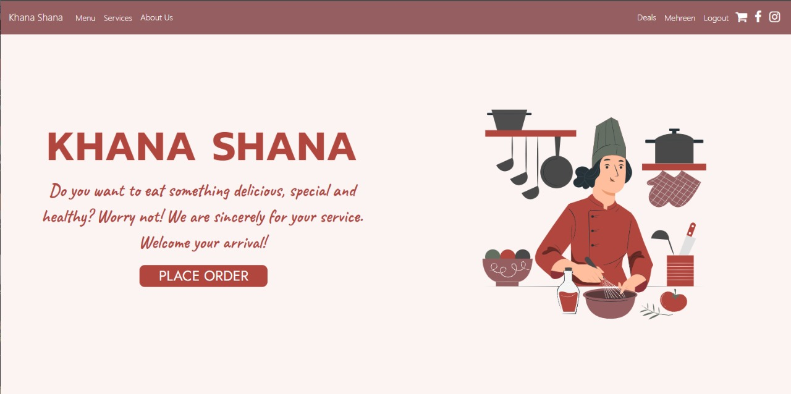

# Khana Shana

An elegant food ordering web application running on top of reactjs, redux, and firebase.

## Getting Started

These instructions will get you a copy of the project up and running on your local machine for development and testing purposes. Find the detailed instructions below:

### Prerequisites

* Install latest version of node: [Node](https://nodejs.org/en/) 

* Install latest version of npm: [NPM](https://www.npmjs.com/)

* Set up [Create React App](https://github.com/facebook/create-react-app)

* Set up your project on [Firebase](https://firebase.google.com/)

* For Facebook Login, set up a project on [Facebook Developers](https://developers.facebook.com/)

### Installation

* Clone the repository from here: 

`git clone https://github.com/shehryaarsharif/KhanaShana-Client.git`

* Then go to the local directory and run below commands:

`npm install`

`npm start`

* After following above steps, your browser should automatically launch. If not, open your browser and run:

`http://localhost:3000`

### Features

* User Login and Signup authentication with Firebase or Facebook
* Menu displaying food items with Filter Search
* Implementation of Shopping Cart with Redux and Local Storage
* Implementation of Order History along with Order Tracking and Cancel Order feature
* Discount Wheel feature which can only be availed once a week
* Customer Reviews implemented using React Forms
* Maintaining dedicated user profiles for each individual customer

### Technology Stack

* React 
* Redux
* Bootstrap
* React Material
* CSS/SCSS
* HTML5
* Firebase

### Backend Management

For backend management of the web application, clone the [admin side repository.](https://github.com/shehryaarsharif/KhanaShana-Admin)

### Authors

 * Momin Mehmood Butt
 * Mehreen Masood

You can also find the list of all [contributors](https://github.com/shehryaarsharif/KhanaShana-Client/graphs/contributors) who participated in this project.

### Deployment

* Deployed link of [Admin Side](http://khana-shana-2020.web.app)

* Deployed link of [Client Side](http://khana-shana-client.web.app)

This project was built as part of the course Software Engineering - CS 360 at Lahore University of Management Sciences.
